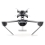

# Hello

In the daylight i help companies with their Cloud Native and Digital Transformation journey translating complexity into scalable solutions.

I value the power and beauty of code over memorization.

When the night falls, you'll find me cooking up Raspberry Pi projects, cultivating diverse Kubernetes environments and safeguarding a horde of wild Gobots.

- 🤔 No, not these gobots -->

- 😉 These Gobots -->
  
  
  

